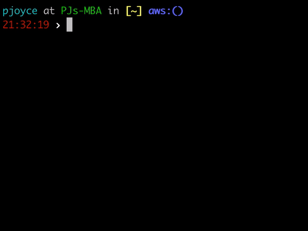
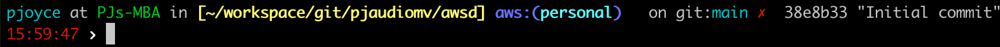

# awsd - AWS Profile Switcher in Go

---


awsd is a command-line utility that allows you to easily switch between AWS Profiles.



## Table of Contents

- [Installation](#installation)
    - [Homebrew](#homebrew)
    - [Makefile](#makefile)
    - [To Finish Installation](#to-finish-installation)
    - [Upgrading](#upgrading)
- [Usage](#usage)
    - [Switching AWS Profiles](#switching-aws-profiles)
    - [Switching AWS Regions](#switching-aws-regions)
    - [Persist Profile and Region across new shells](#persist-profile-and-region-across-new-shells)
    - [Show your AWS Profile in your shell prompt](#show-your-aws-profile-in-your-shell-prompt)
    - [Add autocompletion](#add-autocompletion)
    - [TL;DR (full config example)](#tldr-full-config-example)
- [Contributing](#contributing)
- [License](#license)

## Installation

Make sure you have Go installed. You can download it from [here](https://golang.org/dl/).

### Homebrew

```sh
brew tap radiusmethod/awsd
brew install awsd
```

### Makefile

```sh
make install
```

### To Finish Installation
Add the following to your bash profile or zshrc then open new terminal or source that file

```sh
alias awsd="source _awsd"
```

Ex. `echo 'alias awsd="source _awsd"' >> ~/.zshrc`

### Upgrading
Upgrading consists of just doing a brew update and brew upgrade.

```sh
brew update && brew upgrade radiusmethod/awsd/awsd
```

## Usage

### Switching AWS Profiles

It is possible to shortcut the menu selection by passing the profile name you want to switch to as an argument.

```bash
> awsd work
Profile work set.
```

To switch between different profiles files using the menu, use the following command:

```bash
awsd
```

This command will display a list of available profiles files in your `~/.aws/config` file or from `AWS_CONFIG_FILE`
if you have that set. It expects for you to have named profiles in your AWS config file. Select the one you want to use.

### Switching AWS Regions

You can also switch your active AWS region. The interactive picker fuzzy-matches the same way the profile picker does.

```bash
> awsd set region us-east-1
Region us-east-1 set.

> awsd set region          # interactive picker
> awsd list regions        # list known regions
> awsd unset region        # clear the active region
```

Setting a region exports `AWS_REGION` and `AWS_DEFAULT_REGION` in the calling shell. Profile and region are independent — `awsd set profile` does not change your region, and vice versa.

### Persist Profile and Region across new shells
To persist the active profile (and region) when you open new terminal windows, add the following to your bash profile or zshrc. It handles both the current `key=value` format and the legacy single-line format.

```bash
if [ -f ~/.awsd ]; then
  if grep -q '=' ~/.awsd; then
    while IFS='=' read -r k v; do
      case "$k" in
        profile) [ -n "$v" ] && export AWS_PROFILE="$v" ;;
        region)  [ -n "$v" ] && export AWS_REGION="$v" AWS_DEFAULT_REGION="$v" ;;
      esac
    done < ~/.awsd
  else
    export AWS_PROFILE=$(cat ~/.awsd)
  fi
fi
```

### Show your AWS Profile in your shell prompt
For better visibility into what your shell is set to it can be helpful to configure your prompt to show the value of the env variable `AWS_PROFILE`.



Here's a sample of my zsh prompt config using oh-my-zsh themes

```sh
# AWS info
local aws_info='$(aws_prof)'
function aws_prof {
  local profile="${AWS_PROFILE:=}"
  echo -n "%{$fg_bold[blue]%}aws:(%{$fg[cyan]%}${profile}%{$fg_bold[blue]%})%{$reset_color%} "
}
```

```sh
PROMPT='OTHER_PROMPT_STUFF $(aws_info)'
```

### Add autocompletion
Source the installed completion script from your bash profile or zshrc:

```bash
source _awsd_autocomplete
```

This completes profile names on `awsd <TAB>`, the `set`/`unset`/`list` subcommands, and their arguments — e.g. `awsd set region <TAB>` lists regions, `awsd set profile <TAB>` lists profiles.

### TL;DR (full config example)
```bash
alias awsd="source _awsd"
source ~/bin/awsd_autocomplete.sh
if [ -f ~/.awsd ]; then
  if grep -q '=' ~/.awsd; then
    while IFS='=' read -r k v; do
      case "$k" in
        profile) [ -n "$v" ] && export AWS_PROFILE="$v" ;;
        region)  [ -n "$v" ] && export AWS_REGION="$v" AWS_DEFAULT_REGION="$v" ;;
      esac
    done < ~/.awsd
  else
    export AWS_PROFILE=$(cat ~/.awsd)
  fi
fi
```

## Contributing

If you encounter any issues or have suggestions for improvements, please open an issue or create a pull request on [GitHub](https://github.com/radiusmethod/awsd).

## License

This project is licensed under the MIT License - see the [LICENSE](LICENSE) file for details.


Inspired by https://github.com/johnnyopao/awsp
